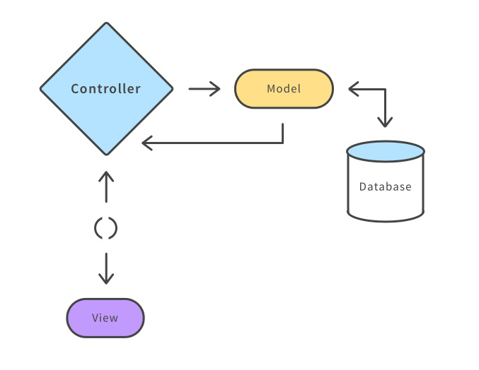

# Rails-cheatsheet

 - [Creating a new application](#Creating-a-new-application)
   - [CLI commands](#CLI-commands)
   - [Full Example](#Full-Example)
 - [Database CLI commands](#Database-CLI-commands)
 - [Additional helpful rails CLI commands](#Additional-helpful-rails-CLI-commands)
 - [Routes](#Routes)
   - [URL structure](#URL-structure)
   - [Creating routes](#Creating-routes)
   - [Limiting routes](#Limiting-routes)
   - [Custom routes](#Custom-routes)
 - [Controllers](#Controllers)
   - [Generate a controller](#Generate-a-controller)
   - [Common Active-Record methods](#Common-Active-Record-methods)
   - [Associations](#Associations)
 - [Models](#Models)
   - [Making a model](#Making-a-model)
   - [Associations](#Associations)
   - [Validations](#Validations)
 - [Migrations](#Migrations)
 - [Scaffold](#Scaffold)

## Architecture



<hr />

## Creating a new application

#### CLI commands

Init a new rails app

```bash
rails new name_of_app
```

you can replace the name of the app with `.` to make your rails app in the current directory

```bash
rails new .
```

<details>
<summary>check out the optional flags</summary>

api (backend) only rails app. used to create a RESTful app:

```bash
--api
```

set the DMS (database management system) to `postgresql` for the rails app

```bash
--database=postgresql
```

skip action-mailer and associated software

```bash
-M
```

skip testing

```bash
-T
```

skip active-storage (software for file uploading)

```bash
--skip-active-storage
```
</details>

#### Full Example

```bash
rails new . -MT --skip-active-storage --api --database=postgresql
```

<hr />
## Database CLI commands

Dropping, Creating, migrating or seeding

`rails db:drop`
`rails db:create`
`rails db:migrate`
`rails db:seed`

Setup will Create, Migrate and then Seed

`rails db:setup`

Reset will Drop, Create, Migrate and Seed

`rails db:reset`

<hr />

## Additional helpful rails CLI commands

rails console will drop you into a Ruby repl (either `irb` or `pry` using `gem 'pry-rails'`). The Ruby repl will have the Rails app's models loading for testing:

```bash
rails console
# -- OR --
rails c
```

command to start the rails server:

```bash
rails server
# -- OR --
rails s
```

list all of the routes for the server:

```bash
rails routes
```

<hr/>

## Routes

#### URL structure


#### Creating routes

We can define our routes in `/config/routes.rb`

Short hand to create conventional Full CRUD routes (`index`, `show`, `create`, `update`, and `destroy`)

```ruby
resources :items
```

HTTP Verb | Path | Controller#Action | Used for
--------- | ---- | ----------------- | -------
GET | /items | items#index | returns a list of all items
POST | /items | items#create | create a new photo
GET | /items/:id | items#show | returns a specific photo
PATCH/PUT | /items/:id | items#update | update a specific photo
DELETE | /items/:id | items#destroy | delete a specific photo

> Note: This example is assuming that our server has an "items" resource

#### Limiting routes

If we don't need complete Full CRUD routes for a resource, we can limit them by adding onto our short hand method:

```ruby
resources items, only: :index
# -- OR for multiples--
resources items, only: [:index, :show]
```
Alternatively, we can exclude routes:

```ruby
resources items, except: :index
# -- OR for multiples--
resources items, except: [:index, :show]
```

#### Custom routes

we can create a custom route if needed:

```ruby
get '/name-for-route', to: 'controller_name#method_name'
```

Reference: http://guides.rubyonrails.org/routing.html

<hr />

## Controllers

This is where the functional logic for our application is executed. Also this is mostly (outside of `seed.rb`) where we use our active-record methods

#### Generate a controller

We can use the rails generator command to make a controller. By convention, the last name in the controller should be plural, E.X. `UserPhotos`

`rails g controller PluralResourceName`

This will create a controller file in `/app/controllers/`

#### Common Active-Record methods

get all of an item
```ruby
.all
```

get one specific item with an id
```ruby
.find(id_value_goes_here)
```

create a new item with a hash of data
```ruby
  .new(hash_of_data)
  .save
  # -- OR --
  .create(hash_of_data)
```

updating a specific item with a hash of data
```ruby
# first find the item
.find(id_value_goes_here)
# then update it
.update(hash_of_data)
```

deleting a specific item
```ruby
# first find the item
.find(id_value_goes_here)
# then delete it
.destroy
```

<details>
<summary>Check out some additional active record commands</summary>

Select a single record (row) from the database based on a specific column
```ruby
.find_by(column: value)
```

Select multiple records (rows) from the database based on a specific column
```ruby
.where(column:value)
```

Get a total number for all records found
```ruby
.count
```

making a custom SQL "select" query
```ruby
.select("custom query here")
```
</details>

#### Associations

We can use an "include" option to add an associated resource to our response

```ruby
  render json: @user, include: :posts
```

This will include all of the posts that belong to our single user. The body of this response would look something like this:

```JSON
{
  "id": 1,
  "name": "CoolCat88",
  "age": 31,
  "posts": [
    {"some post data"},
    {"more post data"}
  ],
  "created_at": "2020-03-30 20:48:16",
  "updated_at": "2020-03-30 20:48:16"
}
```
We can return multiple resources that belong directly to our return resource like this:

```ruby
  render json: @user, include: [:posts, :friends, :comments]
```

This would return all posts, friends, and comment that belong directly to our user.

We can also return nested associations:

```ruby
  render json: @user, include: { posts: {include: :comments} }
```
This will include the posts that belong to our user. Also each post will have all of it's comments

> Note: Be careful not to use too deeply nested "include" statements. This can cause ***very*** many/costly SQL queries if we include too much.

Reference: http://guides.rubyonrails.org/action_controller_overview.html

<hr />

## Models

Models are where we define our associations. We can also add validations to our models and make custom methods.

#### Making a model

Generate a model and create a migration. Naming convention for modals is singular.

```bash
rails g model Item
```

or generate with table columns

```bash
rails g model Item weight:integer name:string
```

#### Associations

One-to-many

```ruby
class User < ApplicationRecord
  has_many :posts
end

class Post < ApplicationRecord
  belongs_to :user
end
```

Many-to-many

```ruby
class Food < ApplicationRecord
  has_and_belongs_to_many :flavors
end

class Flavor < ApplicationRecord
  has_and_belongs_to_many :foods
end
```

One-to-Many through

```ruby
class Teacher < ApplicationRecord
  has_many :students, through: :courses
end

class Student < ApplicationRecord
  has_one :teacher, through: :course
end
```

#### Validations

In a model, the "validates" method can be passed a column followed by one or several options.

Example:
```ruby
  validates :username, uniqueness: true
```

Validations Reference: https://guides.rubyonrails.org/active_record_validations.html

Model Reference: https://guides.rubyonrails.org/active_record_basics.html


<hr />

## Migrations

create a new migration with 

`rails g migration NameForFile options`
 - options can be passed in after the file name

<details>
<summary>Migration Data Types</summary>

* `:boolean`
* `:date`
* `:datetime`
* `:decimal`
* `:float`
* `:integer`
* `:references`
* `:string`
* `:text`
* `:time`
* `:timestamp`
</details>

When the name of the migration follows the format `AddXXXToYYY` followed by a list of columns, it will add those columns to the existing table

```
$ rails g migration AddDateTakenToPhotos date_taken:datetime
```

The above creates the following migration: 

```rb
class AddDateTakenToPhotos < ActiveRecord::Migration[5.0]
  def change
    add_column :photos, :date_taken, :datetime
  end
end
```

You can also add a new column to a table with an index

```
$ rails g migration AddDateTakenToPhotos date_taken:datetime:index
```

The above command generates the following migration: 

```rb
class AddDateTakenToPhotos < ActiveRecord::Migration[5.0]
  def change
    add_column :photos, :date_taken, :datetime
    add_index :photos, :date_taken
  end
end
```

The opposite goes for migration names following the format: `RemoveXXXFromYYY`

```
$ rails g migration RemoveDateTakenFromPhotos date_taken:datetime
```

The above generates the following migration: 

```rb
class RemoveDateTakenFromPhotos < ActiveRecord::Migration[5.0]
  def change
    remove_column :photos, :date_taken, :datetime
  end
end
```

Reference: https://guides.rubyonrails.org/active_record_migrations.html

<hr />

## Scaffold

Scaffolding is great for prototypes but don't rely too heavily on it: http://stackoverflow.com/a/25140503

`rails g scaffold ResourceName`
 - creates migration, model, a full CRUD controller and adds default routes

Example: 
```bash
rails g scaffold Item weight:integer name:string
```
